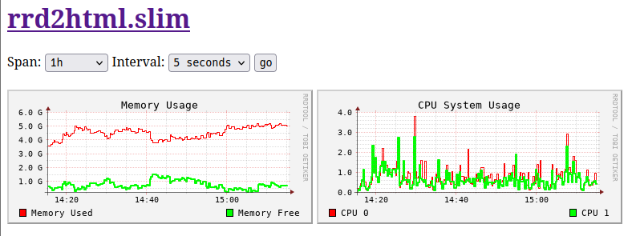

= https://github.com/LevitatingBusinessMan/rrd2html.rb[rrd2html.rb]

This is a ruby script for generating graphs with https://oss.oetiker.ch/rrdtool/[rrdtool] using a toml configuration, and then embedding them into html using base64.

= Requirements
* https://github.com/fbernier/tomlrb[tomlrb^] gem
* https://rrdroot.org[rrdroot^] command

= Usage
`$ ./rrd2html.rb configfile.toml`

This will generate `<br/>` tags.

If no argument is defined it will try to open `/etc/rrd2html.toml`.

== rrd2html.slim

There is also the `.slim` html templating file, `rrd2html.slim`.
This is configured for CGI, and supports refreshing the page automatically.
You can execute this with:

`$ CONF=configfile.toml slimrb rrd2html.slim`

If these scripts don't have the exact behaviour that you seek I encourage you to edit them.



= Configuration
A sample graph for plotting cpu usage: 
```toml
[[graphs]]
title = "CPU Usage - 1 Hour"
dimensions = [300, 100]
span = "1h"
lines = [
    { file = "/var/lib/collectd/localhost/cpu-0/cpu-user.rrd",   name="CPU User",   val="value:AVERAGE", color="#FF0000" },
    { file = "/var/lib/collectd/localhost/cpu-0/cpu-system.rrd", name="CPU System", val="value:AVERAGE", color="#00FF00" },
    { file = "/var/lib/collectd/localhost/cpu-0/cpu-idle.rrd",   name="CPU Idle",   val="value:AVERAGE", color="#0000FF" }
]
```

However, we can reduce the complexity by moving default values out of the graphs table.
Here we only overwrite the color of the idle data:
```toml
# prefix for the .rrd file paths
datadir="/var/lib/collectd/localhost"

# defaults for all graphs
dimensions = [300, 100]
span = "1h"
color="#FF0000" 

[[graphs]]
title = "CPU Usage - 1 Hour"
lines = [
    { file = "cpu-0/cpu-user.rrd",   name="CPU User", },
    { file = "cpu-0/cpu-system.rrd", name="CPU System" },
    { file = "cpu-0/cpu-idle.rrd",   name="CPU Idle", color="#0000FF" }
]
```

You could omit even those defaults because there is also defaults defined in the script.
So a barebones configuration only needs lines containing a file and a name.
```toml
datadir="/var/lib/collectd/localhost"

[[graphs]]
lines = [
    { file = "cpu-0/cpu-user.rrd",   name="CPU User", },
    { file = "cpu-0/cpu-system.rrd", name="CPU System" },
    { file = "cpu-0/cpu-idle.rrd",   name="CPU Idle" }
]
```

= CGI configuration
If you want to serve these files via webserver directly I recommend using https://redmine.lighttpd.net/projects/lighttpd/wiki[lighttpd^].
Lighttpd won't care if your script outputs response headers.

Take this example config:
```
server.modules = (
	"mod_cgi"
)

server.username		= "http"
server.groupname	= "http"
server.document-root	= "/srv/http/cgi"
dir-listing.activate	= "enable"
index-file.names	= ( "index.html" )

cgi.assign     = (
    ".rb" => "/usr/bin/ruby",
    ".slim" => "/usr/bin/slimrb",
)
```

With this you could for copy `rrd2html.slim` to `/srv/http/cgi/rrd2html.slim`, and set `/etc/rrd2html.toml` and it should just work.
